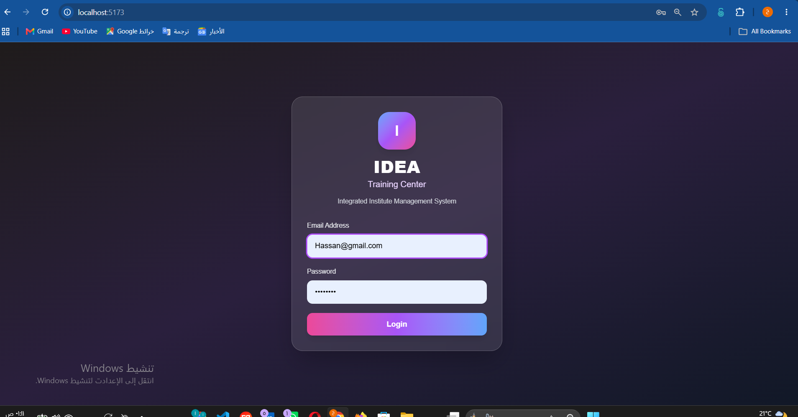
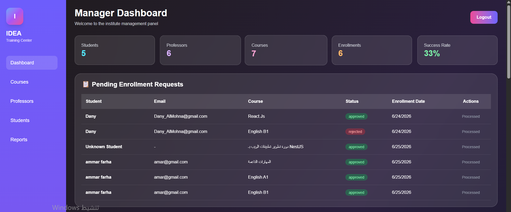
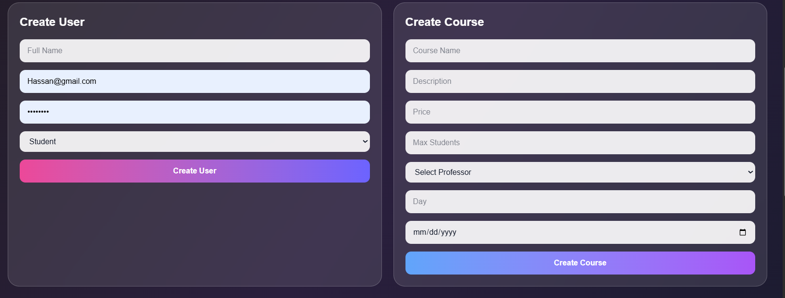
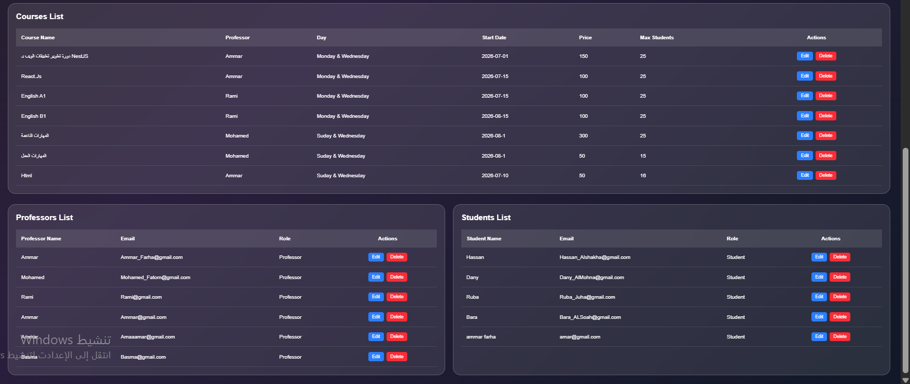
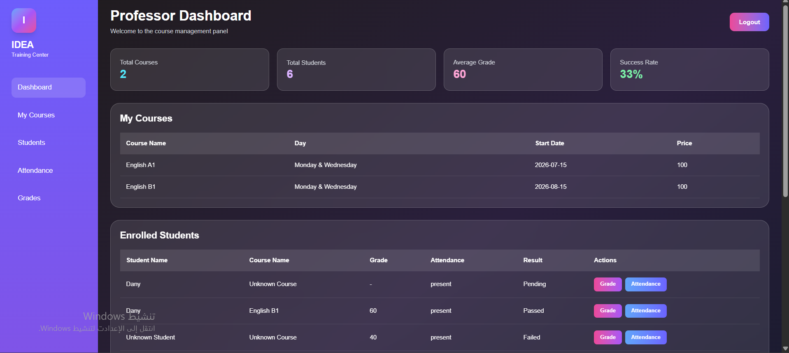
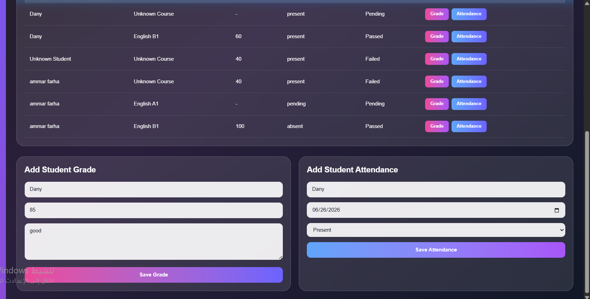
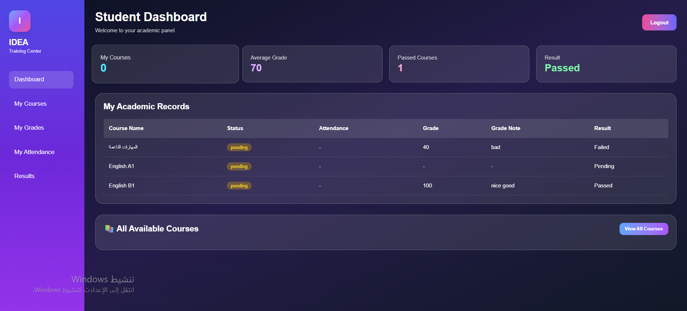
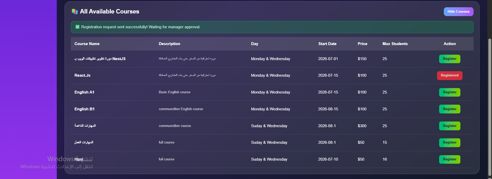

# 🎓 IDEA Training Center - نظام إدارة المعهد التدريبي المتكامل

> نظام متكامل لإدارة المعاهد التدريبية يربط بين الطلاب والمدرسين والإدارة في منصة واحدة موحدة.

---








## 📋 جدول المحتويات

- [نظرة عامة](#نظرة-عامة)
- [الميزات الرئيسية](#الميزات-الرئيسية)
  - [الواجهة الخلفية (Backend)](#الواجهة-الخلفية-backend)
  - [الواجهة الأمامية (Frontend)](#الواجهة-الأمامية-frontend)
- [التقنيات المستخدمة](#التقنيات-المستخدمة)
- [هيكل المشروع](#هيكل-المشروع)
- [متطلبات التشغيل](#متطلبات-التشغيل)
- [طريقة التشغيل محلياً](#طريقة-التشغيل-محلياً)
  - [تشغيل قاعدة البيانات](#تشغيل-قاعدة-البيانات)
  - [تشغيل الخادم الخلفي](#تشغيل-الخادم-الخلفي)
  - [تشغيل الواجهة الأمامية](#تشغيل-الواجهة-الأمامية)
- [حسابات تجريبية](#حسابات-تجريبية)
- [مخطط قاعدة البيانات](#مخطط-قاعدة-البيانات)
- [توثيق API](#توثيق-api)
- [المساهمة](#المساهمة)
- [الترخيص](#الترخيص)

---

## 🌟 نظرة عامة

**IDEA Training Center** هو نظام إدارة متكامل للمعاهد التدريبية، يوفر واجهات منفصلة لكل من الطلاب والمدرسين والمديرين. يهدف النظام إلى أتمتة عمليات التسجيل، تتبع الحضور، إدارة الدرجات، وتحليل أداء المعهد، مع توفير تجربة مستخدم سلسة وآمنة.

**الرؤية**: تقديم حل تقني متكامل لإدارة المعاهد التدريبية يسهل العمليات الإدارية والأكاديمية ويعزز التواصل بين جميع الأطراف.

---

## ⚡ الميزات الرئيسية

### 🖥️ الواجهة الخلفية (Backend)

- **🔐 نظام توثيق متقدم**: مصادقة JWT مع صلاحيات حسب الدور (مدير، مدرس، طالب)
- **👥 إدارة المستخدمين**: إنشاء وحذف وتعديل الطلاب والمدرسين (صلاحية المدير فقط)
- **📚 إدارة المقررات**: إنشاء وتعديل وحذف المقررات مع تعيين المدرسين
- **📝 إدارة التسجيلات**: نظام طلبات تسجيل مع آلية موافقة/رفض من المدير
- **📊 الحضور والدرجات**: تتبع الحضور وإدارة الدرجات مع حساب النتائج تلقائياً
- **📈 التحليلات والتقارير**: إحصائيات المقررات والمعهد (نسبة النجاح، متوسط الدرجات)
- **🛡️ حماية متقدمة**: تشفير كلمات المرور باستخدام bcrypt، حماية المسارات بالصلاحيات

### 🎨 الواجهة الأمامية (Frontend)

- **🎯 لوحات تحكم مخصصة**: واجهات منفصلة حسب الدور مع عرض بيانات مخصصة
- **📊 جداول تفاعلية**: عرض البيانات في جداول مع إمكانيات التصفية والبحث
- **✨ تجربة مستخدم سلسة**: تأثيرات حركية باستخدام Framer Motion وأنماط حديثة
- **📱 تصميم متجاوب**: يعمل بشكل مثالي على جميع الأجهزة والشاشات
- **📈 إحصائيات فورية**: عرض مؤشرات الأداء الرئيسية (كروت إحصائية)
- **🔔 نظام رسائل**: إشعارات فورية للمستخدم حول العمليات التي يقوم بها
- **🎨 تصميم عصري**: واجهة مبنية بتقنية Tailwind CSS مع تأثيرات زجاجية

---

## 🛠️ التقنيات المستخدمة

### الواجهة الأمامية (Frontend)
React 18

TypeScript

Vite (Build Tool)

Tailwind CSS

React Router v6

Framer Motion (Animations)

Axios / Fetch API


### الواجهة الخلفية (Backend)

NestJS

TypeScript

MongoDB

Mongoose ODM

JWT Authentication

bcrypt (Password Hashing)

Class Validator

### الأدوات والتطوير

Git & GitHub

npm / yarn

ESLint

Prettier

Jest (Testing)


---

## 📁 هيكل المشروع
idea-training-center/
├── frontend/ # الواجهة الأمامية
│ ├── src/
│ │ ├── components/
│ │ │ ├── Login.tsx
│ │ │ ├── StudentDashboard.tsx
│ │ │ ├── ProfessorDashboard.tsx
│ │ │ └── ManagerDashboard.tsx
│ │ ├── App.tsx
│ │ ├── main.tsx
│ │ ├── index.css
│ │ └── App.css
│ ├── index.html
│ ├── package.json
│ ├── vite.config.ts
│ └── tailwind.config.js
│
├── backend/ # الواجهة الخلفية
│ ├── src/
│ │ ├── users/ # وحدة المستخدمين
│ │ │ ├── dto/
│ │ │ ├── schemas/
│ │ │ ├── users.controller.ts
│ │ │ ├── users.service.ts
│ │ │ └── users.module.ts
│ │ ├── courses/ # وحدة المقررات
│ │ │ ├── dto/
│ │ │ ├── schemas/
│ │ │ ├── courses.controller.ts
│ │ │ ├── courses.service.ts
│ │ │ └── courses.module.ts
│ │ ├── enrollments/ # وحدة التسجيلات
│ │ │ ├── dto/
│ │ │ ├── schemas/
│ │ │ ├── enrollments.controller.ts
│ │ │ ├── enrollments.service.ts
│ │ │ └── enrollments.module.ts
│ │ ├── app.module.ts
│ │ ├── app.controller.ts
│ │ ├── app.service.ts
│ │ └── main.ts
│ ├── package.json
│ ├── tsconfig.json
│ └── nest-cli.json
│
└── README.md


---

## 📋 متطلبات التشغيل

قبل البدء، تأكد من تثبيت البرامج التالية على جهازك:

- **Node.js** (الإصدار 14 أو أحدث)
- **npm** أو **yarn** (مدير الحزم)
- **MongoDB** (الإصدار 4.4 أو أحدث) - محلياً أو عبر MongoDB Atlas
- **Git** (لنسخ المستودع)

---

## 🚀 طريقة التشغيل محلياً

### 1️⃣ تشغيل قاعدة البيانات

#### الخيار الأول: MongoDB محلية
```bash
# تثبيت MongoDB عبر Homebrew (macOS)
brew install mongodb-community
brew services start mongodb-community

# أو عبر نظام Windows
# قم بتحميل MongoDB من الموقع الرسمي وتثبيته

# تأكد من تشغيل الخدمة
mongod --dbpath ~/data/db


2️⃣ تشغيل الواجهة الخلفية (Backend)
# الانتقال إلى مجلد الباك إند
cd backend

# تثبيت الاعتماديات
npm install
# أو
yarn install

# تشغيل خادم التطوير
npm run start:dev
# أو
yarn start:dev

# الخادم سيعمل على: http://localhost:3000
ملاحظة: الباك إند سيعمل تلقائياً على المنفذ 3000 مع تمكين CORS للتواصل مع الفرونت إند.

3️⃣ تشغيل الواجهة الأمامية (Frontend)
# فتح نافذة طرفية جديدة
# الانتقال إلى مجلد الفرونت إند
cd frontend

# تثبيت الاعتماديات
npm install
# أو
yarn install

# تشغيل خادم التطوير
npm run dev
# أو
yarn dev

# الخادم سيعمل على: http://localhost:5173

🔑 حسابات تجريبية
يمكنك استخدام الحسابات التالية لتجربة النظام:

🧑‍💼 حساب المدير (Manager)
📧 البريد الإلكتروني: Hassan@gmail.com
🔑 كلمة المرور: 12345678
👤 الدور: Manager

👨‍🏫 حساب المدرس (Professor)
يجب إنشاؤه عبر لوحة تحكم المدير

👨‍🎓 حساب الطالب (Student)
يجب إنشاؤه عبر لوحة تحكم المدير

